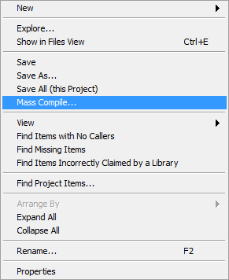
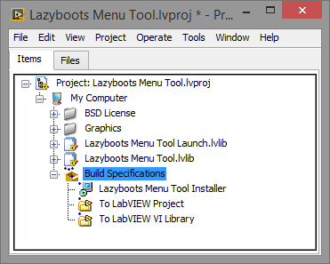
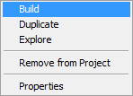

* [Download](https://github.com/hejiamin/lazyboots-archive.git) the source code.
* If the version of the source code is different with your LabVIEW version, you may need mass compile the source code first by selecting the _Mass Compile..._ menu from right click menu on the project item in the project explorer.  

* Expand _Build Specifications_.  

* Build _To LabVIEW Project_ distribution by selecting the _Build_ menu from the right click menu.  

* Build _To LabVIEW VI Library distribution by selecting the _Build_ menu from the right click menu.
* Build _Lazyboots Menu Tool Installer_ installer by selecting the _Build_ menu from the right click menu.