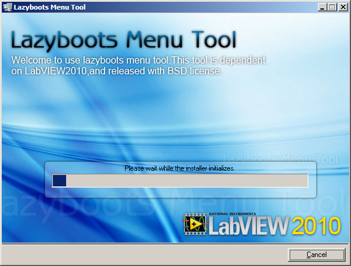
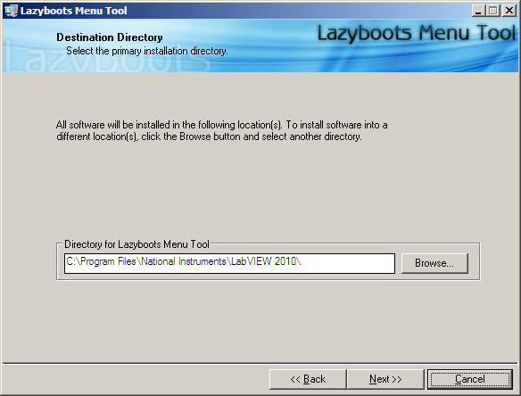

Download the volume from DOWNLOADS page.  
Run “**Setup.exe**”, restart your LabVIEW after installation.  

**NOTE**: All LabVIEW source files will be installed to “**<project>\Lazyboots Menu Tool**” and “**<vi.lib>\SLK\Lazyboots Menu Tool**”