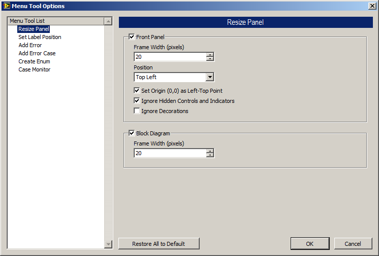

Select “**Tools**» **Lazyboots Menu Tool**» **Options...**” from menu bar, the options dialog will be launched as below:

All the available parameters are list in the dialog. You could set for the different features by selecting the left list.